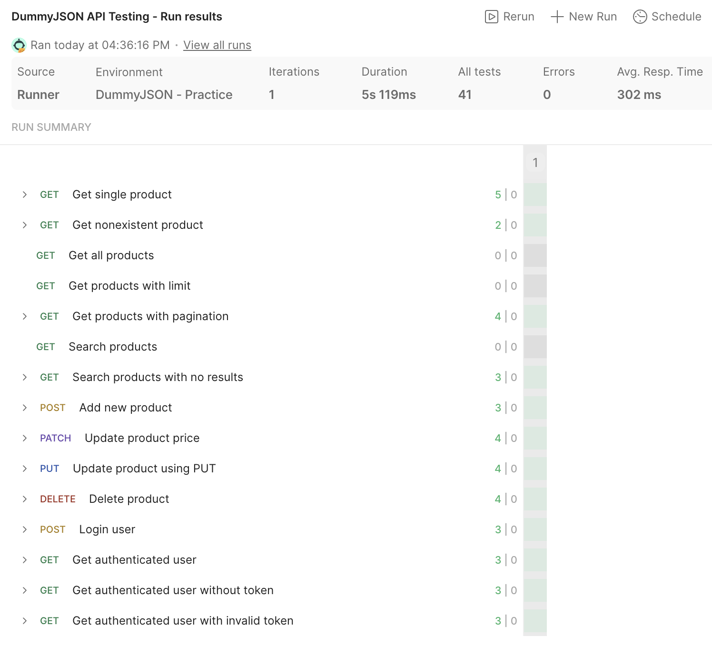

# DummyJSON API Testing

Hands-on REST API testing portfolio project using Postman and the DummyJSON API.

## Project Status

**Completed**

## Project Objective

The purpose of this project was to practice functional REST API testing using Postman and document a repeatable API testing workflow.

The project covers positive and negative scenarios, CRUD operations, authentication, environment variables, automated assertions, and collection-level test execution.

## Application Under Test

- API: DummyJSON
- Base URL: `https://dummyjson.com`
- Tool: Postman

## Scope

The test scope includes:

- retrieving a single product
- handling a nonexistent product
- retrieving product lists
- query parameters
- pagination using `limit` and `skip`
- product search
- search with no matching results
- creating a product
- partial update using PATCH
- update using PUT
- deleting a product
- user login
- authenticated access
- access without an authentication token
- access with an invalid authentication token

## Test Coverage

The Postman collection contains:

- **15 API requests**
- **41 automated assertions**
- positive and negative test scenarios
- GET, POST, PATCH, PUT, and DELETE requests
- HTTP status validation
- response body validation
- authentication checks
- dynamically stored access token
- reusable environment variables

Detailed scenarios are documented in:

[`documentation/api-test-scenarios.md`](documentation/api-test-scenarios.md)

## Test Execution Results

Final collection run:

| Metric | Result |
|---|---:|
| Requests executed | 15 |
| Automated assertions | 41 |
| Passed assertions | 41 |
| Failed assertions | 0 |
| Runner errors | 0 |

Detailed execution summary:

[`documentation/test-summary.md`](documentation/test-summary.md)

### Execution Evidence



## Authentication

The login request retrieves an access token during execution.

The token is stored dynamically in the active Postman environment and used by the authenticated request.

Negative authentication scenarios cover:

- missing access token
- invalid access token

Authentication tests are configured to avoid relying on stored authentication cookies where this could affect the expected negative result.

## Environment Variables

The project uses environment variables for reusable configuration and authentication data.

The repository contains a safe template:

[`postman/DummyJSON-Portfolio-Template.postman_environment.json`](postman/DummyJSON-Portfolio-Template.postman_environment.json)

The template includes:

- `base_url`
- `username`
- empty `password`
- empty `access_token`

The working environment containing authentication data is intentionally not included in the repository.

## Postman Collection

The exported collection is available here:

[`postman/DummyJSON-API-Testing.postman_collection.json`](postman/DummyJSON-API-Testing.postman_collection.json)

The collection is organized into:

- `01 - Products - Read`
- `02 - Products - Write`
- `03 - Authentication`

## How to Run

1. Import the Postman collection.
2. Import the portfolio environment template.
3. Add the required test password locally to the environment.
4. Select the environment in Postman.
5. Run the full `DummyJSON API Testing` collection using the Collection Runner.
6. Review the request results and automated assertions.

## Important Limitations

DummyJSON simulates create, update, and delete operations.

POST, PATCH, PUT, and DELETE responses represent the expected operation, but changes are not persisted on the server.

Response time was observed during execution but was not used as a pass/fail criterion because no performance requirement was defined.

## Repository Structure

```text
api-testing-dummyjson/
├── README.md
├── documentation/
│   ├── api-test-scenarios.md
│   └── test-summary.md
├── evidence/
│   └── postman-collection-run.png
└── postman/
    ├── DummyJSON-API-Testing.postman_collection.json
    └── DummyJSON-Portfolio-Template.postman_environment.json

```

## Skills Demonstrated

- REST API testing
- Postman
- HTTP methods
- HTTP status codes
- JSON response validation
- positive and negative testing
- query parameters and pagination
- CRUD testing
- authentication testing
- Bearer token handling
- environment variables
- Postman scripting
- automated assertions
- Collection Runner
- test documentation
- execution evidence